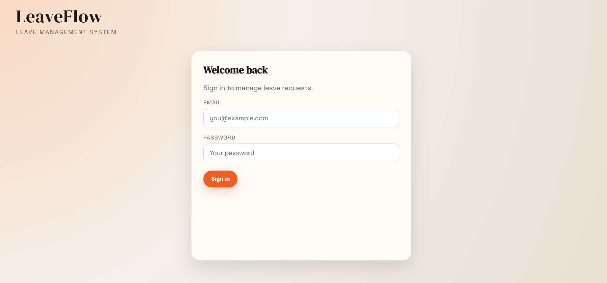
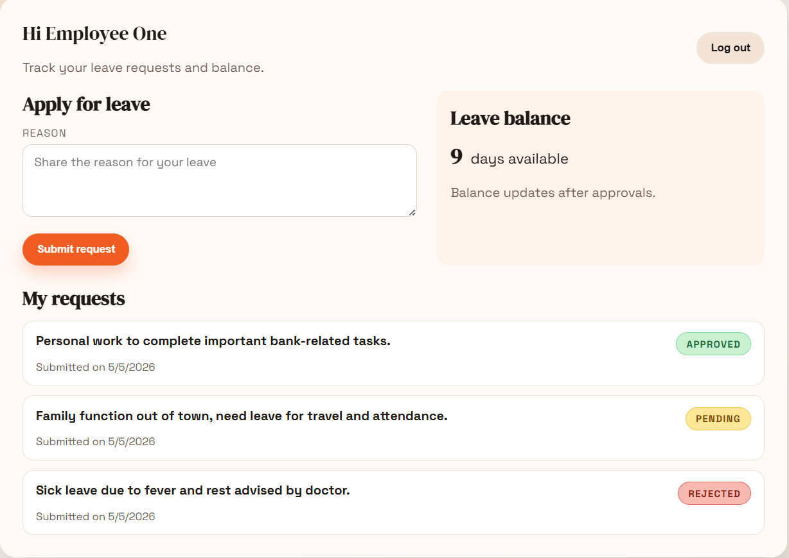
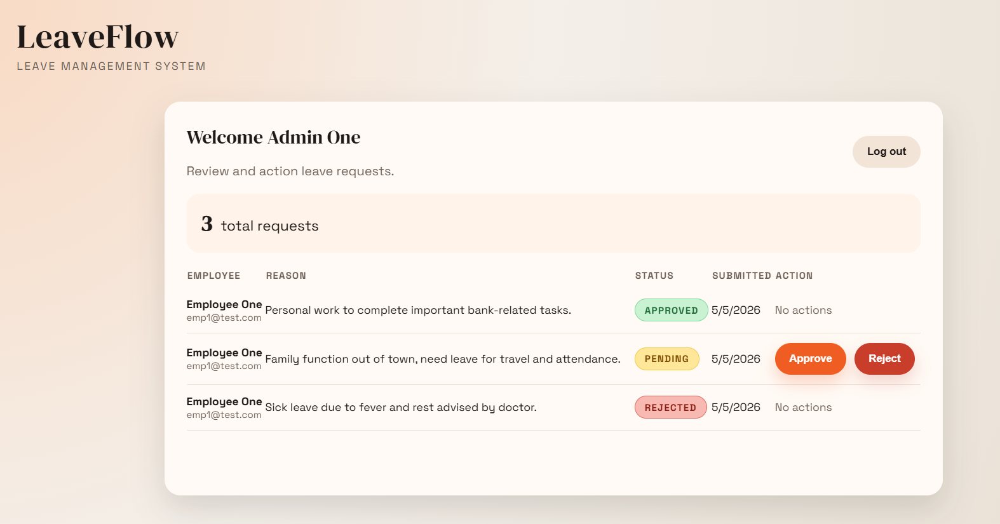

# Leave Management System

## Project Overview

A full-stack Leave Management System that enables employees to apply for leave and administrators to review and approve or reject requests. The system implements secure authentication, role-based access control, and real-time status tracking.

---

## Live Links

- Backend API: https://leave-management-system-7zvp.onrender.com
- Frontend App: https://leave-management-system-dusky.vercel.app

---

## Features

### Authentication

- JWT-based login for Admin and Employee roles
- Secure password handling using bcrypt

### Employee Features

- Apply for leave with reason
- View personal leave requests
- Track leave status (PENDING, APPROVED, REJECTED)
- View remaining leave balance

### Admin Features

- View all leave requests
- Approve or reject requests
- Automatic leave balance deduction on approval
- Dashboard with total request count

---

## Tech Stack

- Frontend: React + Vite + TypeScript + Axios
- Backend: Node.js + Express + TypeScript
- Database: PostgreSQL
- Authentication: JWT + bcrypt

---

## Architecture

Frontend (React) -> Backend (Express API) -> PostgreSQL Database


## Folder Structure

```
backend/
  db/
    schema.sql
  scripts/
    seed.ts
    apply-schema.ts
  src/
    controllers/
    db/
    middleware/
    routes/
    types/
    server.ts
  tsconfig.json

frontend/
  tsconfig.json
  tsconfig.node.json
  src/
    components/
    pages/
    App.tsx
    api.ts
    index.css
    main.tsx
    vite-env.d.ts
  vite.config.ts

README.md
```

---

## Setup Instructions

### 1) Backend Setup

```bash
cd backend
npm install
```

Create `.env` file:

```
PORT=5000
DATABASE_URL=your_postgres_connection
JWT_SECRET=your_secret
```

---

### 2) Database Setup

```bash
psql -U postgres -c "CREATE DATABASE leave_management;"
psql -U postgres -d leave_management -f db/schema.sql
```

---

### 3) Seed Demo Data

```bash
npm run seed
```

---

### 4) Start Backend

```bash
npm run dev
```

---

### 5) Frontend Setup

```bash
cd ../frontend
npm install
npm run dev
```

---

## API Endpoints

Base URL: `http://localhost:5000/api`

- `POST /login` -> User login
- `POST /apply-leave` -> Apply leave (Employee)
- `GET /my-leaves` -> Get employee leaves
- `GET /all-leaves` -> Get all leaves (Admin)
- `PUT /leave/:id` -> Approve / Reject (Admin)

---

## Demo Accounts

### Admin

- admin1@test.com / 123456
- admin2@test.com / 123456

### Employee

- emp1@test.com / 123456
- emp2@test.com / 123456

---

## AI Usage

GitHub Copilot and ChatGPT were used to:

- Design the PostgreSQL schema and relationships
- Implement JWT authentication and role-based access control
- Generate backend API structure and optimize business logic
- Assist in building responsive React UI components
- Debug issues and improve development efficiency

These tools helped accelerate development while maintaining clean and modular code.

---

## Challenges Faced

- Implementing secure role-based authentication
- Ensuring leave balance updates only after approval
- Preventing duplicate approval or rejection actions
- Managing consistent state between frontend and backend

---

## Future Improvements

- Email notifications for leave status updates
- Pagination for large datasets
- Calendar integration for leave visualization
- Role-based dashboards with analytics

---

## Demo

### Screenshots





---

## Final Note

This project focuses on practical problem-solving, clean architecture, and efficient development using modern tools. The goal was to build a functional, scalable system within a limited time frame while maintaining code quality and usability.
